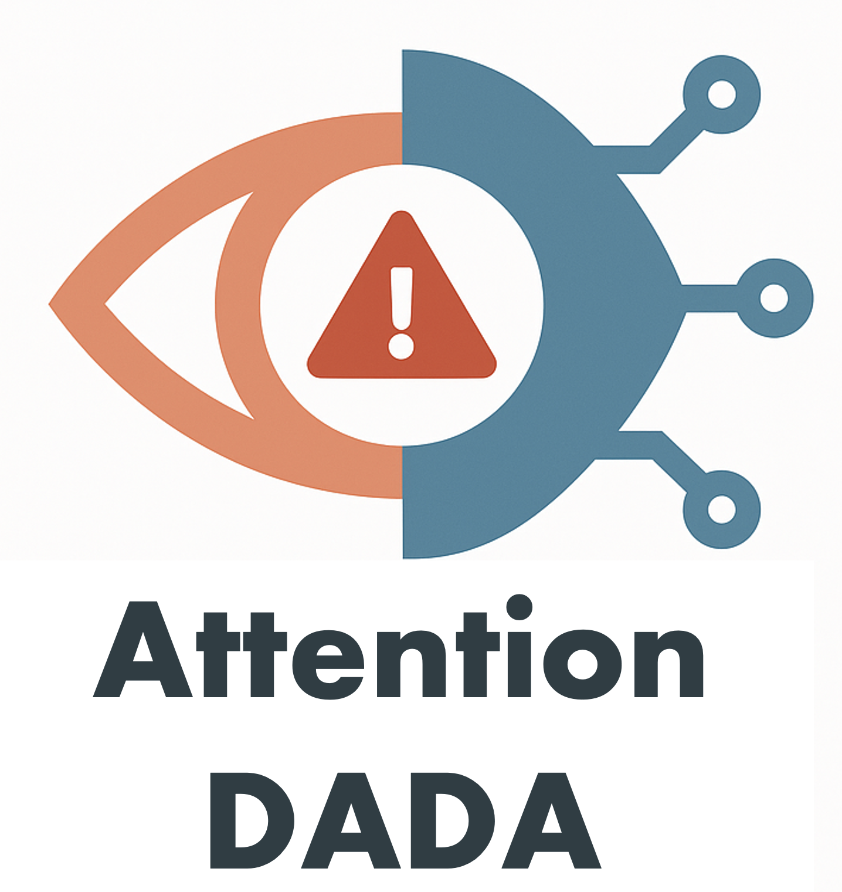
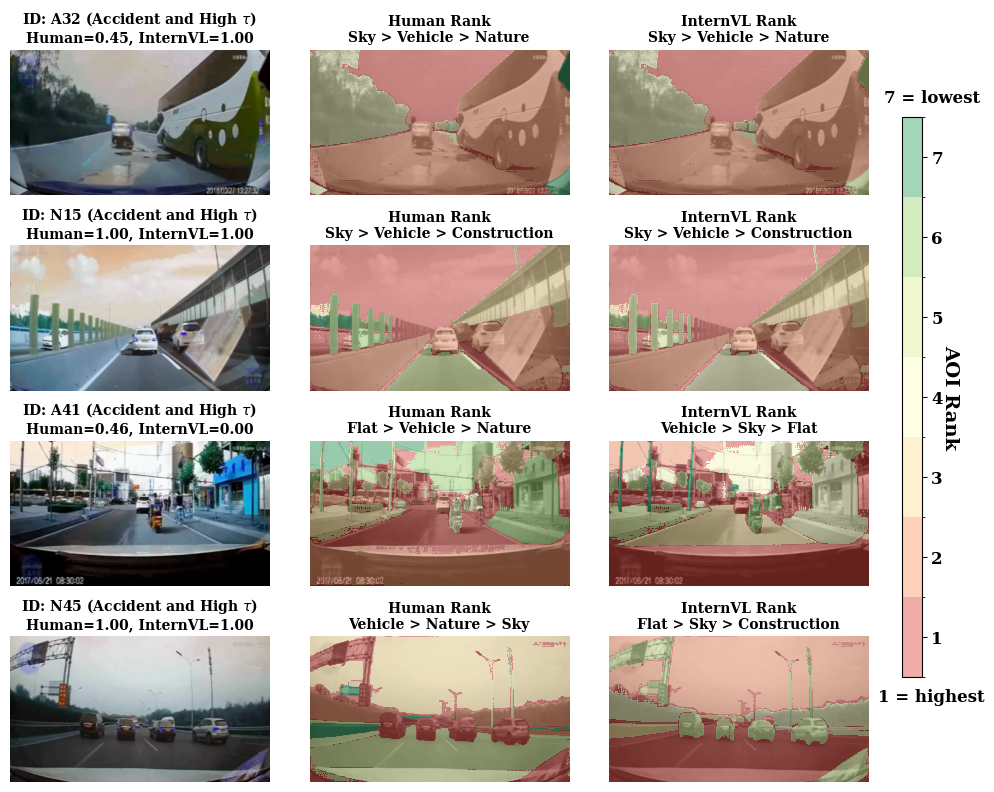

# Attention-DADA
<p style="text-align: center;">

</p>

[](https://opensource.org/licenses/MIT)
[](https://example.com/dataset)
[](https://example.com/download)
<!-- [](https://arxiv.org/abs/your-paper-id) -->
## 🚀 Overview
Welcome to the official repository for **Attention-DADA**, a benchmark dataset for quantifying human-AI visual alignment in high-stakes scenarios.

Traditional datasets for accident anticipation often overlook the critical component of *how* a decision is made. **Attention-DADA** addresses this gap by providing not just outcomes, but also the underlying **attentional processes**. Our dataset contains real-world traffic videos (both accident and non-accident) enriched with:
1.  Detailed human predictions and risk assessments.
2.  Frame-by-frame eye-gaze data from 30 participants.

This repository is the central hub for the dataset, documentation, and evaluation code. It is being prepared for submission to the AAAI 2026 AI Alignment Track and is designed to support reproducible and transparent research.

---

## ✨ Key Features
-   **High-Fidelity Gaze Data**: Frame-level eye-gaze annotations provide a direct window into human attentional patterns.
-   **Rich Annotations**: Beyond gaze, the dataset includes granular risk predictions from multiple human annotators, ensuring high inter-rater reliability.
-   **Diverse Scenarios**: A curated collection of real-world driving videos, including challenging accident and non-accident situations.
-   **Benchmark-Ready**: Designed to directly support key research tasks, including VLM accident prediction and human-AI attentional alignment analysis.

---

## 📊 Examples
The Attention-DADA dataset enables a deep analysis of visual attention in dynamic driving scenarios. You can compare human gaze patterns with a Video-Language Model's (VLM) attention, generate saliency maps, or track attentional priorities over time.

Below is a key visualization from our study, comparing human vs. model attention.

<p align="center">
  
</p>
<p align="center">
  <em><strong>Fig. 1:</strong> Qualitative comparison of attentional rankings between human observers and the InternVL model. Each row shows the original video frame, the corresponding human attention map, and the model's attention map. Attentional priority is visualized on a 7-rank colormap from highest (Rank 1, red) to lowest (Rank 7, green). The text above each map details the object rankings, highlighting critical differences in where humans and models focus.</em>
</p>

---


## 📂 Dataset Details
*(This section will be updated with download links upon the dataset's official release.)*

### Statistics

| Metric | Value |
| :--- | :--- |
| **Total Processed Clips** | **500** (100 videos × 5 time segments) |
| **Total Base Videos** | **100** |
| ↳ Accident Scenarios | 50 |
| ↳ Normal (Non-Accident) Scenarios | 50 |
| **Human Participants** | 30 |
| **Video Resolution** | 1920x1080 |
| **Frame Rate** | 30 FPS |

### Data Structure
The repository and data are organized as follows:
```
Mind-the-Gap/
├── data/
│   ├── videos/
│   │   ├── accident/
│   │   │   ├── video_001.mp4
│   │   │   └── ...
│   │   └── normal/
│   │       ├── video_051.mp4
│   │       └── ...
│   └── gaze/
│   │    ├── P01_gaze.json
│   │    └── ...
│   │    
│   └── prediction/
│            └── prediction_data.csv
│
├── scripts/
│   ├── load_dataset.py     # Example data loading script
│   └── benchmark.py        # Example benchmarking script
│
├── requirements.txt
├── LICENSE
└── README.md
```

---

## 🏁 Installation and Usage
*(This section will be updated with download links upon the dataset's official release.)*
### Prerequisites
- Python 3.10+
- PyTorch 2.7+
- CUDA 12.8+ (Recommended)

### Installation
1.  **Clone the repository:**
    ```bash
    git clone [https://github.com/anonymAAAI2026/Mind-the-Gap.git](https://github.com/anonymAAAI2026/Mind-the-Gap.git)
    cd Mind-the-Gap
    ```

2.  **Install dependencies:**
    ```bash
    pip install -r requirements.txt
    ```

3.  **Download the Dataset:**
    *(A download link and script will be provided upon official release.)*
    
    You will be able to place the dataset files into the `data/` directory.

### Usage Examples

#### Loading the Dataset
Here is a basic example of how to load the data using PyTorch. See `scripts/load_dataset.py` for more details.
```python
import torch
from torch.utils.data import Dataset, DataLoader
import json
import cv2

class DrivingDataset(Dataset):
    def __init__(self, annotation_file, video_dir):
        self.video_dir = video_dir
        with open(annotation_file, 'r') as f:
            self.annotations = json.load(f) # Assuming JSON format
    
    def __len__(self):
        return len(self.annotations)
    
    def __getitem__(self, idx):
        item = self.annotations[idx]
        video_path = f"{self.video_dir}/{item['video_id']}.mp4"
        label = item['label']
        
        # Your video/frame loading and preprocessing logic here
        # For example:
        # frames = load_frames_from_video(video_path, item['timestamps'])
        # return torch.tensor(frames), label
        return video_path, label

# Example instantiation
# dataset = DrivingDataset('data/annotations/prediction_data.json', 'data/videos/')
# dataloader = DataLoader(dataset, batch_size=32, shuffle=True)
```

#### Running Benchmarks
Use the provided script to evaluate models on the dataset.
```bash
python scripts/benchmark.py \
    --model gemini-2.5-flash \
    --dataset_path data/ \
    --mode zero-shot
```

---

## 📜 Citation
If you use the Attention-DADA dataset or this codebase in your research, please cite our work:
*(Note: Details will be finalized upon publication.)*
```bibtex
@inproceedings{anonymous2026attention,
  title   = {Mind the Gap: Quantifying and Aligning Human-AI Visual Attention for Accident Anticipation},
  author  = {Anonymous Authors},
  booktitle = {Proceedings of the AAAI Conference on Artificial Intelligence},
  year    = {2026}
}
```

## 📄 License
This project is released under the [MIT License](LICENSE).

## 💬 Contact
For questions, bug reports, or collaboration inquiries, please open an issue in this repository.
